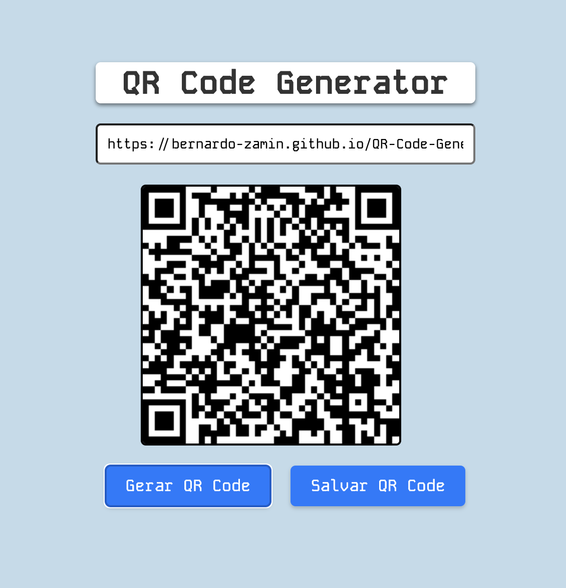

# Aplicação Web de um Gerador de QR-CODE

Uma aplicação web simples e elegante para gerar um QR-CODE e salvar.

## Tecnologias Utilizadas :computer:

- HTML5 :orange_book:
- CSS :art:
- JavaScript :yellow_heart:

## Demonstração :link:

Confira a aplicação em ação:
- [Gerar QR-CODE](https://bernardo-zamin.github.io/QR-Code-Generator/)

## Autor :bust_in_silhouette:

Desenvolvido por [Bernardo Zamin](https://github.com/Bernardo-Zamin)
